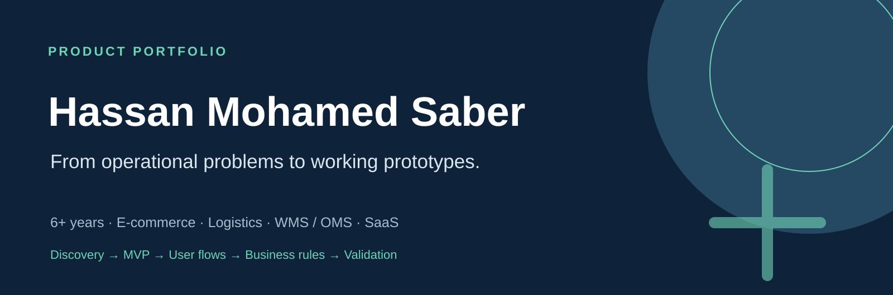
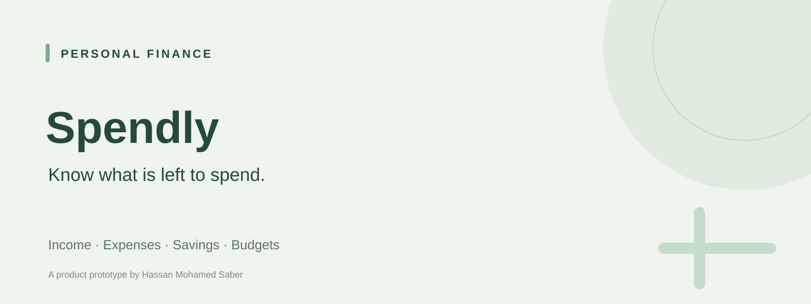
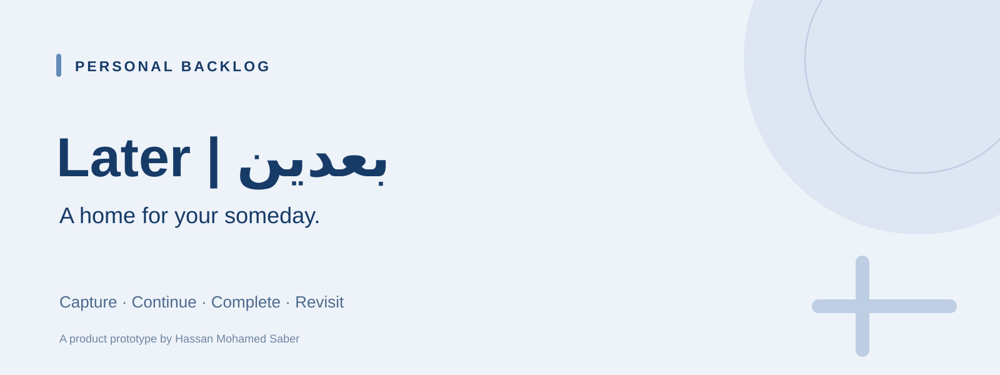
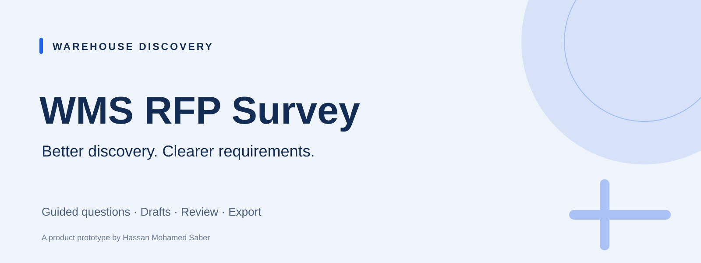

# Hassan Mohamed Saber

**Solution Consultant moving toward Product Management.**

I bring **6+ years of experience** across e-commerce, logistics, operations, WMS/OMS, implementation and solution consulting. I turn customer problems into defined MVPs, practical user flows and working prototypes.

Riyadh, Saudi Arabia · Focus: e-commerce, logistics technology and B2B SaaS

## 01 · Flagship — DRE Flow

**Deliver. Return. Exchange.**

An e-commerce operations product for brands managing their own drivers. The product problem is fragmented assignment, return handling, execution evidence and cash reconciliation.

| Product surface | Workflow focus |
| --- | --- |
| Merchant Portal | Delivery / Return / Exchange orders, driver assignment, POD review, COD and settlement |
| Driver App | Assigned tasks, execution evidence and collection recording |
| Customer Returns & Exchanges | Original-order verification, item selection and merchant review |
| Platform Admin | Merchant and platform oversight |

**Key product decision:** one shared backend architecture connects these experiences around the same operational records. Proof of delivery (POD), cash on delivery (COD) and driver settlement are separate operational concerns with their own rules.

[**Product website →**](https://rayeh.hassan-saber1911.chatgpt.site/)

**Private beta.** The public website is accessible; operational portals require sign-in. The implementation repository remains private. Internal flows and screenshots were not verified in this portfolio review, so this is a product overview rather than an open demo. Live payment billing and external Salla/Shopify integrations are not presented as available features.

## Working prototypes

Each product below includes a focused case study, real screenshots and a public demo. Preview images use sample data; no generated UI screenshots or adoption claims.

<table>
<tr>
<td width="50%" valign="top">

<h3>02 · Spendly</h3>

Help people see what is left after expenses and savings.

<strong>Product rule:</strong> Income − Expenses − Savings.

<a href="https://github.com/hassansaber1911-dot/Spendly">Case study &amp; repository</a> · <a href="https://hassansaber1911-dot.github.io/Spendly/">Live Demo</a>

</td>
<td width="50%" valign="top">

<h3>03 · SplitTrip</h3>

Reconcile group expenses when payers and consumers differ.

<strong>Product rule:</strong> Paid ≠ Consumed.

<a href="https://github.com/hassansaber1911-dot/Splittrip">Case study &amp; repository</a> · <a href="https://hassansaber1911-dot.github.io/Splittrip/">Live Demo</a>

</td>
</tr>
<tr>
<td width="50%" valign="top">

<h3>04 · Later | بعدين</h3>

Capture intentions without forcing every idea into a deadline.

<strong>Product decision:</strong> Someday is a valid context.

<a href="https://github.com/hassansaber1911-dot/Later-Ba3den">Case study &amp; repository</a> · <a href="https://hassansaber1911-dot.github.io/Later-Ba3den/">Live Demo</a>

</td>
<td width="50%" valign="top">

<h3>05 · WMS RFP Survey</h3>

Make 3PL discovery structured, reviewable and exportable.

<strong>Product decision:</strong> Coverage plus operational context.

<a href="https://github.com/hassansaber1911-dot/WMS-RFP-Survey">Case study &amp; repository</a> · <a href="https://hassansaber1911-dot.github.io/WMS-RFP-Survey/">Live Demo</a>

</td>
</tr>
</table>

## How I approach product work

1. Identify the user, problem and desired outcome.
2. Define the MVP and explicit exclusions.
3. Model the user flow, business rules and edge cases.
4. Build a working prototype and test the core loop.
5. Add measurement where implemented and choose the next validation question.

The public prototypes include GA4 instrumentation and browser-local persistence. Instrumentation is a foundation for learning, not proof of traction. Their READMEs distinguish current capabilities from future scope.

**Product discovery · MVP definition · Business analysis · Solution design · User flows · Operational rules · Prototyping**
